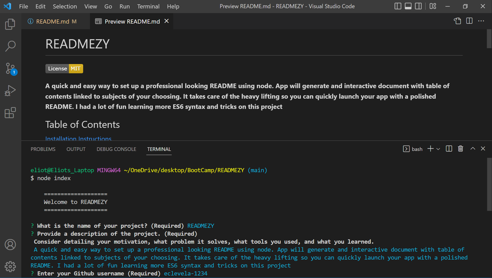

# READMEZY

**A quick and easy way to set up a professional looking README using node. App will generate and interactive document with table of contents linked to subjects of your choosing. It takes care of the heavy lifting so you can quickly launch your app with a polished README. I had a lot of fun learning more ES6 syntax and tricks on this project.**

## Table of Contents

[Installation Instructions](#installation-instructions)

[Usage Information](#usage-information)

[Contribution Guidelines](#contribution-guidelines)

[Collaboration Credits](#collaboration-credits)

[Video}(#video)

[Questions](#questions)

[License](#license)

## Installation Instructions

Make sure to have node installed in advance. Clone the repository then set up node environment by typing "npm install" into the integrated terminal. You're all set up!
## Usage Information

Run node index.js from the root directory to start the program. Follow the on screen prompts. Remember that it will be easy to update your document after it is created so don't stress the details too much! Your README.md file will be saved in the 'dist' directory.
## Contribution Guidelines

Anyone can submit a pull request. Please reach out if you do as this repo is not closely monitored. I would like to eventually have a seemless way to add images to the document.
## Collaboration Credits

So far it's just me. Note: I was given a small amout of starter code to begin this project.
## Video
[Open link](https://drive.google.com/file/d/1OODv4flR3_RhjV2-QGOGE-Gdccnw-Bid/view) to view a brief [video](https://drive.google.com/file/d/1OODv4flR3_RhjV2-QGOGE-Gdccnw-Bid/view) tutorial of READMEZY's capabilties.
## Questions
For information about the developer, see my [GitHub Profile](https://github.com/eclevela-1234)

For general questions, please email me: eliothead@live.com
## License
Copyright (c)  2022 by [eclevela-1234](https://github.com/eclevela-1234)

MIT License

Permission is hereby granted, free of charge, to any person obtaining a copy
of this software and associated documentation files (the "Software"), to deal
in the Software without restriction, including without limitation the rights
to use, copy, modify, merge, publish, distribute, sublicense, and/or sell
copies of the Software, and to permit persons to whom the Software is
furnished to do so, subject to the following conditions:

The above copyright notice and this permission notice shall be included in all
copies or substantial portions of the Software.

THE SOFTWARE IS PROVIDED "AS IS", WITHOUT WARRANTY OF ANY KIND, EXPRESS OR
IMPLIED, INCLUDING BUT NOT LIMITED TO THE WARRANTIES OF MERCHANTABILITY,
FITNESS FOR A PARTICULAR PURPOSE AND NONINFRINGEMENT. IN NO EVENT SHALL THE
AUTHORS OR COPYRIGHT HOLDERS BE LIABLE FOR ANY CLAIM, DAMAGES OR OTHER
LIABILITY, WHETHER IN AN ACTION OF CONTRACT, TORT OR OTHERWISE, ARISING FROM,
OUT OF OR IN CONNECTION WITH THE SOFTWARE OR THE USE OR OTHER DEALINGS IN THE
SOFTWARE.

For more information visit https://opensource.org/licenses/MIT
